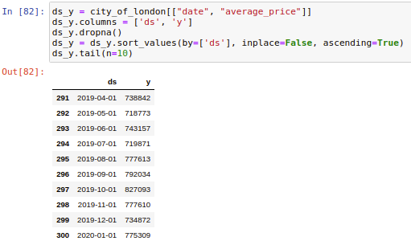
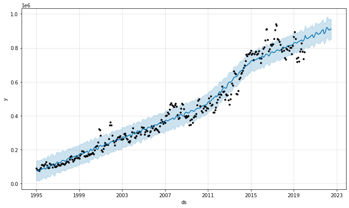
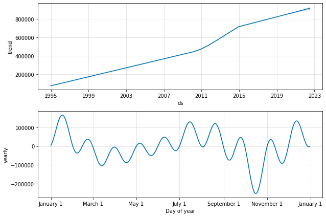

# House Prices Forecast

## Description
Modeling house prices as a time series problem and using [Prophet](https://facebook.github.io/prophet) to predict futures prices.

## Dataset
Using the [Housing in London dataset](https://www.kaggle.com/justinas/housing-in-london) available on Kaggle.

## Requirements
[Poetry](https://python-poetry.org/docs/)

## Conclusions
The dataset has 300 entries for house prices in the city of London. The last row is from 2020-01-01.



Our goal is to forecast house prices for the next 30 months. You can see the predictions below and find out more details at the notebook.ipynb.






## How to install
Please download the dataset and paste it on the `data/` folder.

Run the following command:
```
$ make install
```

It will install the dependencies using Poetry.

## Usage
Please run the following command:
```
$ make run-dev
```

The Jupyter notebook will automatically be opened in your browser.

## License
MIT
